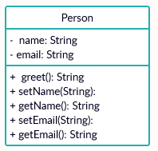
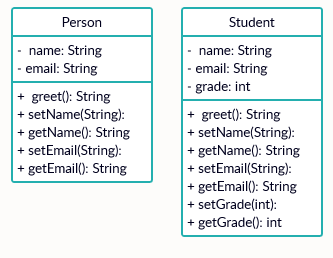
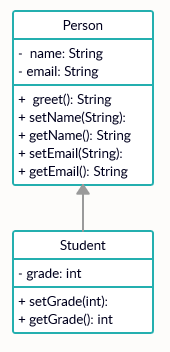
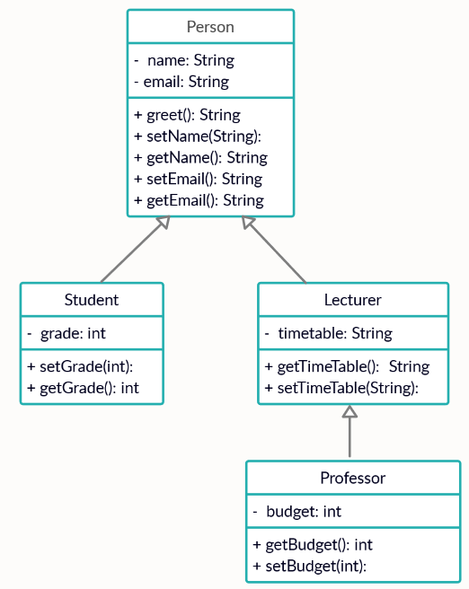

# Inheritance

Now that we have the basics out of the way we come to the meat of object oriented programming, object inheritance. 

We like this concept as programmers as this allows us to logically structure our programs and define relationships between objects, as well as allowing us to simply re-use our code.



## Inheriting

When we create a new class through inheritance, we say that this is a sub class of the (super) class it is based on. 

In doing this the subclass will inherit all methods and attributes associated with the super class. 

## Super!

If we have many objects which do similar things, then we may simply define a base class which contains the shared methods, and have each object inherit this.



## How do I show this?

Inheritance can be shown using a UML (unified modelling language) diagram. The information about each class in our program is represented by a box, which details the attributes and methods of that class and their access modifier.

Consider the below UML diagram, here we have a single class representing a person. This class has two private attributes (shown by the minus sign), a public method which performs a greeting, and getters and setters for name and email address. In a UML diagram, we do not care about _what_ each method does, but we must make note of the names and associated access modifier.





## Adding a second class

This looks like a feature which will be helpful in our program to track students grades at the university.

Let's look at a new Student class which has all of the same methods as Person, but also has a grade attribute and a getter/setter.



No! Not like this! In this diagram we have simply defined new functions with the same name. If the function changes in Person.java, then we must also manually copy and paste this into Student.java. For more complex programs we could easily miss a class and introduce a bug. Let's do this properly, with inheritance



## Doing it properly




Here we see that in the Student box we *only* have the new methods and attributes which are introduced by our Student class, and all others are inherited from Person.

To ensure consistency with other arrows in UML diagrams, the base of the "extends" symbol (a line with a triangular head) goes *from* the class which "inherits from". Think about Student having more "stuff" in it, hence Student gets the wide end of the arrow, and Person gets the pointy end.



## In Possession of Your Faculties

Now that we have our base `Person` class, we can use this for other members of the university.

For example, the university staff members don't particularly care about their grades. However when automated emails are sent to them they still want to be greeted by their name. We typically have two types of staff members in a university, lecturers and professors. One thing that each teacher will need is their teaching timetable. In addition, professors may care about the amount of funding left in their research budget. 

We could describe this relationship through the following diagram:





## Coding It Up

Your task for this lab is to implement this class hierarchy


Make very careful note of each of the private and public variables, and additionally make sure that you follow each of the method names and types closely!



## Submission

You can test your code with 

```
check50 liv-ac-uk/comp122/2021/problems/inheritance
```

And submit your code with:

```
submit50 liv-ac-uk/comp122/2021/problems/inheritance
```
