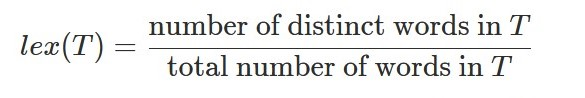

# Text Analysis

Now that we have some core Java knowledge under our belt, we can start to write some properly useful programs!

`wc` is a program which was released with the very first distribution of unix. It's a simple program which we can use to count (*w*ord *c*ount) the number of characters, words, or lines in a text file. For now we will just be operating on Java `String`s, we'll be introducing I/O in a future lab.



## Expressing Yourself

To split strings into words you can use a *regular expression*. This is a cool topic in its own right (see [here](https://en.wikipedia.org/wiki/Regular_expression), as well as [here](https://docs.oracle.com/javase/tutorial/essential/regex/) and [here](https://www.javatpoint.com/java-regex) for more). 

The basic idea is that we define a pattern which we want to find in a query string. Once we have found this pattern in the query we can either split our string into substrings, or replace the pattern with something else entirely.




## A Test of Character

A basic example of a regular expression in Java is the following, which assumes that `line` is a `String`. The result will be an array of `String`s, splitting `line` based on whitespace in the `line` variable. 

The method is what is performing the split, and the pattern in the quotation marks is specifying to split on whitespace (ie. spaces, line breaks, tabs, etc in the string).

```java
String line = "When in the course of human events...";
String[] words = line.split("\\s");

for (String w: words)  {
   System.out.println(w);
}
```

This functionality has been given to you in `WC.java` in the method `wordCount`. This program can be used as so 

```
$ java WC -w "When in the course of human events..."
7
```



## Feed Me a Line

Add new functionality to `WC.java` so that we can give your program the flag `-l` (lowercase L), such that it will print the number of lines in the file. 

Also add functionality to your program so that it will print the number of characters in the input string when given the flag `-m`. 



You can pass text files as command line arguments to your program with the following syntax

```
$ java WC "-w" "\`cat test\`"
4648
$ java WC "-l" "\`cat test\`"
4648 TODO UPDATE CORRECT
$ java WC "-m" "\`cat test\`"
31120
```





## Come Stat Me Bro

We often use statistics to describe text documents (although nowadays we often use deep neural networks). One of the most common metrics which we can use in text analysis is "lexical diversity".

Lexical diversity is defined as the number of distinct words in the document, divided by the total number of words in the document



Add a method to `WC.java` which computes the lexical diversity of a string when the `-s` flag is passed to the program.

```
$ java WC "-s" "\`cat test\`"
TODO ADD RESULT
```



## The Bag of Words

In general text documents aren't a great format to perform numeric analysis on a computer. One of the earliest approaches to featurizing text is called the bag of words. 

As it sounds, this is simply a vector of length `n`, where `n` is the number of unique words in the document. For each field in the vector this is associated with a specific word, with it's value being equal to the count of that specific word. 

Add the functionality to `WC.java` so that it prints the bag of words vector to the terminal with the `-b` flag. 

For example simple phrases would have simple feature vectors

```
$ java WC "-b" "Buffalo buffalo Buffalo buffalo buffalo buffalo Buffalo buffalo"
[8]
```

But more diverse phrases lead to more complex vectors

```
$ java WC "-s" "That that is is that that is not is not is that it it is"
[6, 2, 2, 5]
```



## Representing Lots of Documents

When we have two (or more) documents, we can use the words in each to generate joint bag of words vectors. 

For example, take the phrase "The cat sat on the mat" and the phrase "The pat sat on the stats". We can take *all* of the unique words in both documents and compute the bag of words vectors from these.

|    | cat | mat | sat | stats | on | the | pat |
| -- | --- | --- | --- | ----- | -- | --- | --- |
| 1  | 1   |  1  |  1  |   0   |  1 |  2  |  0  |
| 2  | 0   |  0  |  1  |   1   |  1 |  2  |  1  |


Add this functionality to `WC.java` such that we may enter two documents with the `-v` flag, and it will print the vectors to the terminal.

```
$ java WC "-v" "The cat sat on the mat" "The pat sat on the stats"
[1, 1, 1, 0, 1, 2, 0]
[0, 0, 1, 1, 1, 2, 1]
```


## The Distance Between Ideas

Make a final modification to your program so that it can be given two input strings and the flag `-d`, so that it will print the Euclidean distance between the two joint bag of words vectors. 

```
$ java WC "-d" "The cat sat on the mat" "The pat sat on the stats"
2
```



## Submission

Ensure your `WC.java` compiles correctly and ensure that each of the given flags are working as expected. 

`-w` - print the number of words in a string
`-l` - print the number of lines in a string
`-m` - print the number of characters in a string
`-s` - print the lexical diversity of a string
`-b` - print the bag of words vector representation of a string
`-v` - print the joint bag of words vector representations of two strings
`-d` - print the Euclidean distance between the joint bag of words vector representations of two strings

You can check your code with:

```
check50 liv-ac-uk/comp122/2021/problems/word
```

and submit via:

```
submit50 liv-ac-uk/comp122/2021/problems/word
```


